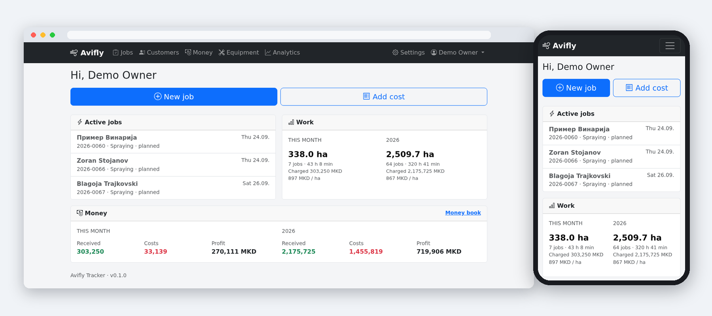
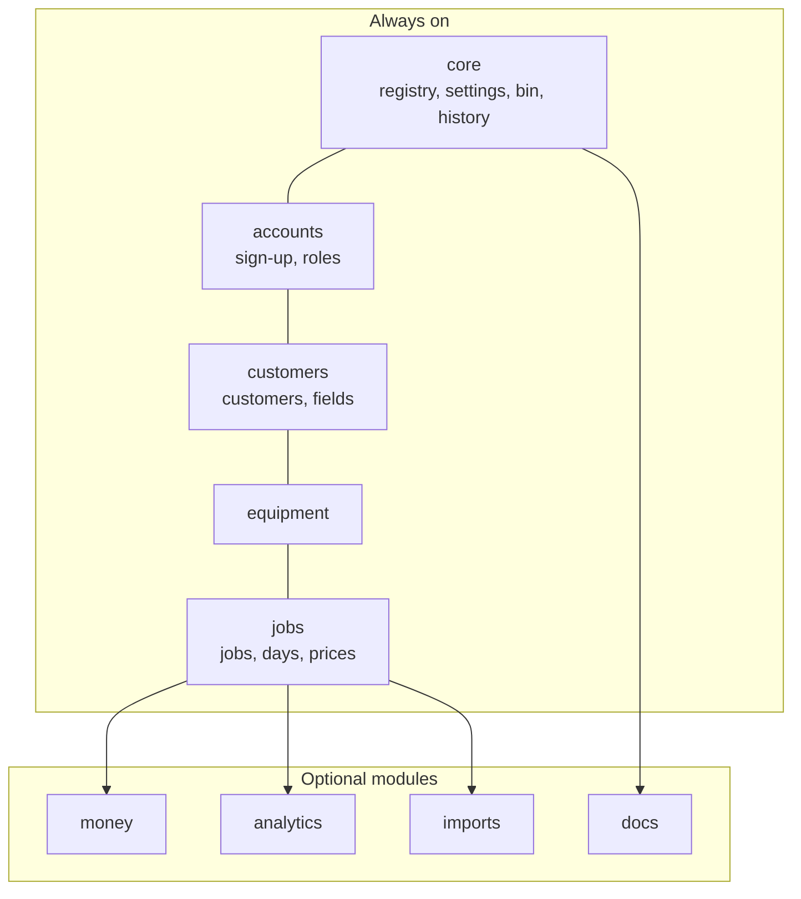
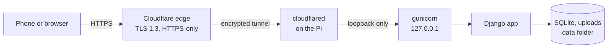
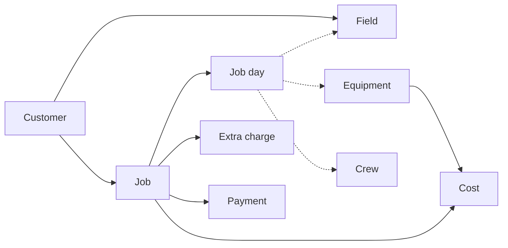

# Avifly Tracker

**Job, money and analytics tracking for a drone crop-spraying business — self-hosted on a
Raspberry Pi and running on the public internet behind Cloudflare.**

Avifly is a two-person spraying business in North Macedonia flying a DJI Agras T50. This
is the app that runs it: every job logged from a phone at the edge of the field, every
payment and cost in one place, and a season's worth of numbers turned into something you
can decide with.

It is a small app built like a big one — a modular Django application where each feature
is a plug-in that can be switched off, covered by tests, and hardened for the internet. It
runs on a 4 GB Raspberry Pi in a house, in under 200 MB of memory, and it is live: reachable
from anywhere over HTTPS through an outbound-only Cloudflare Tunnel, with no open ports and
no cloud server.

**At a glance**

- 9 plug-in modules, about 7,800 lines of Python and 76 server-rendered templates
- 85 automated tests, running in about 25 seconds
- 11 interactive charts and a map of every field worked
- one Raspberry Pi 4, no open ports, and a sandbox rated **1.5 / 10 "OK"** by `systemd-analyze security`

---

## What it does

**Logs the work the way the work happens.** A job is one customer and one piece of work,
made of one or more *days*. Each day carries its own field, equipment, crew, hectares and
start/end times, so a quick morning spray and a three-day trip to the other side of the
country are the same thing in the app — the second just has more days. The price is rate
per hectare × hectares, plus extra charges that each carry a note, and a job's totals,
dates and status are always derived from its days rather than typed in.

**Built for a phone in a field.** *Start now* and *Finish* stamp the time as work
happens. *Continue on another day* opens the next day with the same equipment and crew.
*Repeat* plans the same treatment again. New customers and fields can be created without
leaving the job form — including dropping a pin by GPS or pasting a Maps link.

**Knows where everything is.** Fields are coordinates on a satellite map, with one-tap
calling, Viber, WhatsApp and driving directions. Search is alphabet-independent, a small
thing that matters in a country that writes in two scripts: typing `petrovski` finds
*Петровски*, and `zivko` finds *Живко*.

**Keeps the money straight.** Every job carries its payment — method, amount, note — and
the amount follows the job total unless it is overridden. Costs have categories, receipt
photos and optional links to a job or a machine, so a new propeller shows up on that
drone's page and the fuel for a trip shows up against that job's profit. The money book
is a running balance; everything exports to CSV.

**Turns a season into answers.** Headline numbers are compared against the equivalent
previous period: charged, received, costs, profit, margin, hectares, average price, cost
and profit per hectare, hectares per hour, revenue per working day. Eleven charts cover
money per month, running profit this season against last, hectares over time, top
customers, costs by category, price trends, productivity, payment methods, per-drone
usage and a calendar of days worked — plus a map of every field worked in the period.
Averages per hectare are area-weighted, so one small job at a high price cannot distort
them, and every chart has a table view underneath it.

**Imports flight records.** Files exported from a controller or a flight platform are
parsed into day records, reviewed on screen, then added to a job as days — matching the
drone by its serial number and refusing to import the same flight twice. Importers are
plug-ins: a generic CSV reader ships with the app, and a format-specific one is a single
class.

**Has room for other people.** Sign-up can be opened to new people or closed entirely;
nobody sees anything until an owner approves them and gives them a role. Roles are built by ticking what they may see,
add, edit and delete in each module, including whether they see only their own jobs or
everyone's. Deleted records go to a bin instead of disappearing, and every change is
recorded with who made it and when.

## How it's built

A **modular monolith**: one Django project, one database, one process — but every feature
is a self-contained module that registers what it adds and can be switched off without
touching the others.

The heart of it is a **registry**. Instead of pages hard-coding what they contain, each
module declares its contributions when the app starts:

| A module contributes | And it appears as |
|---|---|
| menu items | navigation, the settings page, dashboard quick actions |
| components | panels inside other modules' pages (the payment block on a job, costs on a machine) |
| editable lists | operation types, crops, cost categories, payment methods, equipment types |
| permission sections | rows in the role editor, automatically |
| extensions | sections inside the job form, file importers, "can't delete, it's in use" rules |
| events | e.g. *a job's totals changed*, which the money module listens for |

The navigation, dashboard, role editor and settings page are therefore assembled from
whatever is installed. Removing `money` from the configuration removes its pages, its
menu entry, the payment block inside the job form, its panels elsewhere and its rows in
the role editor — with a start-up check that refuses to run if something still depends on
it. Adding a feature (invoices, maintenance reminders, another file format) means adding
a module, not editing shared files.

Pages are rendered on the server and sent as HTML. There is no front-end framework and no
build step; a few small scripts add live totals, searchable dropdowns, maps and charts,
and the forms still work without them.

## Technology

| Layer | What's used |
|---|---|
| **Language** | Python 3.13 |
| **Web framework** | Django 5.2 LTS — ORM, forms, templates, permissions, admin |
| **Database** | **SQLite**: a SQL database kept in a single file, in WAL mode so reads and writes don't block each other. All access goes through Django's ORM, so moving to PostgreSQL would be a configuration change |
| **Accounts** | django-allauth — sign-up, e-mail verification, password reset, TOTP two-step login, lockout after failed sign-ins |
| **Change history** | django-auditlog — who changed what, and when, on every record that matters |
| **UI** | Server-rendered Django templates with Bootstrap 5.3 and Bootstrap Icons; Tom Select for searchable dropdowns; HTMX for live search. No single-page app, no bundler, no Node.js |
| **Charts** | Apache ECharts, with a colour-blind-checked palette and a table view under every chart |
| **Maps** | Leaflet, with Esri satellite imagery and OpenStreetMap streets |
| **Images** | Pillow — phone photos are resized and stripped of EXIF (including GPS) on upload |
| **E-mail** | SMTP for password resets, sign-up verification and approval notices |
| **Documentation** | Python-Markdown — the app renders its own documentation at `/docs/` |
| **Serving** | gunicorn under systemd, WhiteNoise for static files, bound to the loopback interface only |
| **Network edge** | Cloudflare — TLS 1.3, HTTPS-only, and an outbound-only Cloudflare Tunnel into the Pi |
| **Security** | PBKDF2-SHA256 password hashing, CSRF protection, a strict Content-Security-Policy, HSTS, HTTPS-only cookies, permission-checked file downloads, PyJWT for verifying Cloudflare Access tokens, optional Turnstile bot check |
| **Quality** | pytest (85 tests), ruff for linting and formatting |
| **Host** | Raspberry Pi 4 (4 GB) on Debian 13 |

## How it runs

- **No way in except the tunnel.** The Pi dials *out* to Cloudflare; the router has no
  open ports, and the app listens only on the Pi's loopback interface, so nothing on the
  internet — or even on the home network — can reach it directly.
- **HTTPS wherever a visitor can see.** Cloudflare terminates TLS 1.3, plain `http://` is
  redirected, browsers are told to use HTTPS only (HSTS), and cookies never travel
  unencrypted. The hop from the tunnel to the app never leaves the machine.
- **Its own account, its own sandbox.** The service runs as a dedicated system account
  with no login, no password and no sudo. systemd gives it a read-only operating system, an
  empty `/home` with only the app put back into it (code read-only, data folder
  read-write), no Linux capabilities, an allow-list of system calls and nothing but network
  and local sockets. `systemd-analyze security` rates it **1.5 "OK"**; an unhardened
  service scores above 9.
- **Private by default on disk.** The data folder belongs to the service account alone,
  uploads are written readable to it and its group only, and the app refuses to start
  against a data folder that belongs to someone else — so a command run by the wrong user
  fails loudly instead of leaving files the service can't read.
- **Updates itself, carefully.** Dependencies are upgraded automatically on a schedule.
  Each upgrade has to pass the full test suite and a health check after the restart, or
  it is rolled back to the exact package set that was running before.

## Security

Every page is behind a login by default. Passwords are hashed with PBKDF2-SHA256 (a
million rounds, salted), repeated failed sign-ins lock the account out for a while, and
two-step login (TOTP) is available. The Django admin signs people in through that same
login page, so it gets the same lockout and the same two-step check instead of a second,
weaker door. Every write is CSRF-protected, and a Content-Security-Policy allows no inline
scripts and no third-party code.

Uploads are type-checked, re-encoded and stripped of location data, then served only
through permission-checked views rather than straight off disk. Deleted records go to a
bin, and every change is recorded with who made it, when and from where. Visitors' real IP
addresses are read only from the tunnel on the same machine, never from a header anyone
could set, and the app can additionally require a valid **Cloudflare Access** token on
every request, which it verifies itself.

## The domain model

Dotted lines are many-to-many: a day can cover several fields, machines and people.

A few rules hold the data together:

- **Derived, not typed.** A job's hectares, dates, amounts and status are recalculated
  from its days and extra charges whenever anything changes. Status follows the work:
  started and not finished is *in progress*, hectares recorded is *done*, nothing yet is
  *planned*.
- **Exact money.** Amounts are decimals, never floating point, and calculated amounts
  round to whole denars.
- **Nothing is really deleted.** Records are hidden and restorable from a bin; only
  owners can purge permanently.
- **Lists are data, not code.** Operation types and their default rates, crops, cost
  categories, payment methods and equipment types are all edited in the app. Equipment
  types even decide which dropdowns appear on a job day, and whether one or several items
  can be picked.
- **Room to grow.** Payments already carry a status and an account, hidden for now, so
  invoices, part-payments and several accounts can arrive later without migrating old
  records. Imported days keep their source, their original record and its id.

## Testing

85 tests run in about 25 seconds and cover the parts that would hurt: job totals and
rounding, multi-day jobs, numbering, derived status, work past midnight, the whole job
form posted the way a browser posts it, payments following job totals, the money book's
running balance, receipts staying private on disk and on the web, analytics figures, CSV
import parsing and duplicate detection, the Cloudflare middleware including a signed
Access token, the admin sign-in going through the protected login, the start-up guard on
the data folder, the role editor's permission sets, the last-owner rule, the documentation
pages and their images, and alphabet-independent search.

## Documentation

The app serves its own documentation at `/docs/` (Settings → Documentation), rendered
from the Markdown in this repository — this page, plus
[how to write a module](docs/modules.md), which walks through adding one using an
invoices module as the example.

## Status

Version 0.1.0 — deployed, reachable from anywhere over HTTPS, and in use by the business.
Next: Cloudflare Access in front of the whole app, off-site backups, invoices and money
owed, a format-specific flight-record importer, and a Macedonian translation.
